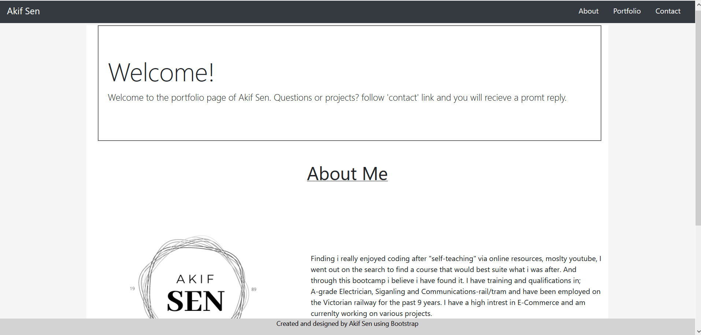

# Portfolio

=======

Portfolio webpage with links; links include:- about, contact, portfolio annd the name logo in the nav is a home link. Allowing users to see screenshots of applications with links to live pages.

This application was contructed using bootstrap to develop an application which was both functioning and responsive, with the use of bootstrap the use of media queries was greatly reduced. It contains information about me, applications i have developed (screeenshots presented on a carousel), contact page not functioning.

live link: https://akif448.github.io/bootcamp-portfolio-page/index.html#
Github link: https://github.com/Akif448/bootcamp-portfolio-page
